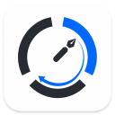

<p align="center">
  
</p>

<h1 align="center">SplitLog</h1>

<p align="center">
  作業時間をSplit単位で記録し、メモとサマリーにまとめる常駐型タイムトラッカー
</p>

SplitLogは、作業セッションを細かなSplitに分けて時間とメモを記録するFlutterアプリです。macOSではメニューバー、Windowsではタスクトレイに常駐します。iPhoneとAndroid向けには、縦画面の全画面UIを実装しています。

既存のSwift/AppKit版SplitLogを参照実装として、macOS、Windows、iPhone、Androidで同じ記録体験を提供することを目標に再構築しています。

## 対応状況

| プラットフォーム | 状況 | 提供形態 |
| --- | --- | --- |
| macOS | v1完成 | ZIPによる直接配布 |
| Windows | v1完成 | ZIPによる直接配布 |
| iPhone | v1機能完成 | 今回の配布対象外 |
| Android | v1機能完成 | 今回の配布対象外 |

今回の配布対象はmacOS版とWindows版です。iPhone、Androidは共通Mobile UI、基本操作、ローカル保存、バックグラウンド復帰を実装し、識別子とアイコンを設定したうえでiPhone SimulatorとAndroid Emulatorの大小画面を確認済みです。実機検証、署名、TestFlight、Release APKは今回の対象に含めません。

## 主な機能

- macOSメニューバー・Windowsタスクトレイへの常駐
- 常駐アイコンのクリックによる表示・非表示と、アイコン付近へのウィンドウ表示
- セッションの追加、切り替え、名前編集、リセット、削除
- `開始`、`停止`、`再開`、`Split`による時間記録
- Split名の編集とSplitごとのメモ記録
- ラジオ方式・チェック方式による時間配分
- 作業時間を可視化するリング表示
- セッション内容からのサマリー生成、編集、コピー
- 標準・テンプレート・ユーザー定義のサマリーフォーマット
- カラー・モノクロテーマ、リング周期などの表示設定
- ウィンドウの前面固定と、外側クリックによる自動非表示
- 設定で有効・無効を切り替えられるグローバルショートカット
- ローカルJSONへの自動保存と旧SplitLogデータのインポート
- iPhone・Android向けの縦画面UIと、バックグラウンド復帰時の経過時間再計算

## macOS版のインストール

動作対象はmacOS 10.15以降です。現在のReleaseビルドにはApple Silicon（arm64）版とIntel（x86_64）版の両方が含まれています。

1. 配布された`SplitLog-macOS-v1.0.0.zip`をダウンロードします。
2. ZIPを展開します。
3. `SplitLog.app`を`アプリケーション`フォルダへ移動します。
4. `SplitLog.app`を起動します。
5. 画面右上のメニューバーに表示されるタイマーアイコンをクリックします。

現行の身内向けZIPはMac App Store配布・Appleによる公証を行っていません。初回起動をmacOSに止められた場合は、`SplitLog.app`をControlキーを押しながらクリックし、`開く`を選択してください。

既存バージョンを更新するときは、SplitLogを終了してから`アプリケーション`フォルダ内のアプリを置き換えてください。通常、アプリを置き換えてもローカルのセッションデータは保持されます。

## Windows版のインストール

1. 配布された`SplitLog-Windows-v1.0.0.zip`をダウンロードします。
2. ZIPを任意のフォルダへ展開します。
3. 展開先の`SplitLog.exe`を起動します。
4. 画面右下のタスクトレイに表示されるSplitLogアイコンをクリックします。

`SplitLog.exe`だけを取り出さず、同梱されているDLLと`data`フォルダを含む展開先一式を保持してください。フォルダ一式であれば、展開後に別の場所へ移動しても問題ありません。

現在のZIPはインストーラーやMicrosoft Storeを使用しない直接配布版です。初回起動時にWindows Defender SmartScreenが表示された場合は、配布元を確認したうえで`詳細情報`から実行してください。更新時はSplitLogを終了し、新しいZIPを別フォルダへ展開してから置き換えます。セッションデータは配布フォルダとは別のユーザー領域に保存されます。

## 基本的な使い方

1. `開始`で計測を始めます。
2. 作業の区切りで`Split`を押します。
3. Split名をクリックして作業名を編集します。
4. ノートアイコンから、そのSplitのメモを記録します。
5. 必要に応じて`停止`と`再開`を使います。
6. ヘッダーのサマリーボタンから内容を確認・編集し、クリップボードへコピーします。

Desktop版では、ウィンドウ外をクリックするとSplitLogは非表示になります。南京錠をオンにすると前面に固定され、外側をクリックしても閉じません。終了するときは、設定画面または常駐アイコンのメニューから`SplitLogを終了`を選択してください。

## グローバルショートカット

| macOS | Windows | 操作 |
| --- | --- | --- |
| `⌘⌃S` | `Ctrl+Alt+S` | Split |
| `⌘⌃X` | `Ctrl+Alt+X` | 停止 |
| `⌘⌃R` | `Ctrl+Alt+R` | 再開 |
| `⌘⌃V` | `Ctrl+Alt+V` | ウィンドウの表示・非表示 |
| `⌘⌃M` | `Ctrl+Alt+M` | 選択中Splitのメモを開く |
| `⌘⌃1` ... `⌘⌃9` | `Ctrl+Alt+1` ... `Ctrl+Alt+9` | 指定位置のSplitを選択・切り替え |
| `⌘⌃0` | `Ctrl+Alt+0` | 最新のSplitを選択 |
| `⌘⌃↑` / `⌘⌃↓` | `Ctrl+Alt+↑` / `Ctrl+Alt+↓` | 選択するSplitを上下に移動 |

ショートカットは設定画面からまとめて無効にできます。キー割り当ての変更には対応していません。

## データとプライバシー

セッション、Split、メモ、設定は端末内の`sessions.json`に保存します。アカウント登録やクラウド同期は使用しません。

macOS版の主な保存先:

```text
~/Library/Containers/com.example.splitlogx/Data/Library/Application Support/SplitLog_x/sessions.json
```

Windows版の保存先:

```text
%LOCALAPPDATA%\SplitLog\sessions.json
```

旧Swift/AppKit版SplitLogがインストールされている場合、macOSでは起動時の確認画面または設定の`ストレージ管理`からデータをインポートできます。Windowsでは設定から旧版の`sessions.json`を手動で選択してインポートできます。

## 開発を始める

```bash
git clone https://github.com/mehuu2000/splitlog_x.git
cd splitlog_x
flutter pub get
flutter run -d macos
```

WindowsではPowerShellから次を実行します。

```powershell
flutter pub get
flutter run -d windows
```

iPhoneとAndroidでも、既定の`lib/main.dart`が実行先OSを判定してMobile UIを起動します。

```bash
flutter run -d "iPhone 17 Pro"
flutter run -d <Android端末ID>
```

必要な環境、プロジェクト構成、テスト方法は[`docs/development.md`](docs/development.md)を参照してください。

## ドキュメント

- [`docs/development.md`](docs/development.md): 開発環境、構成、保存、テスト
- [`docs/release.md`](docs/release.md): ビルド、ZIP作成、配布手順
- [`plan.md`](plan.md): クロスプラットフォーム対応方針とロードマップ

## ロードマップ

1. macOS版v1: 完了
2. Windows版v1: 完了
3. iPhone/Android版: 共通Mobile UIの実装完了、今回の配布対象外
4. 必要性を確認したうえで、実機配布、通知、同期、ストア配布を検討

詳細は[`plan.md`](plan.md)に記録しています。
